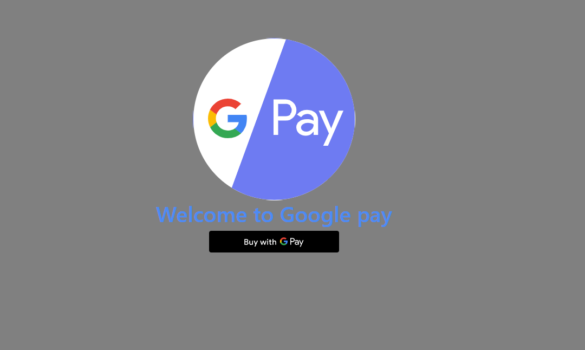

# payment gateway with Google Pay

## Registration and access
#### This merchant is not enabled for Google Pay.
The Google Pay API requires a Google merchantId for sites configuring PaymentsClient for a PRODUCTION environment. A Google merchantId is associated with one or more fully-qualified domains through the Google Pay Developer Profile. Check the returned error details for more information.
#### You have not registered to use this API.
You have not completed the process to register your websites for the Google Pay API. Review our Integration checklist to register and request a review of your website's use of the Google Pay API.
#### This merchant profile does not have access to this feature.
Google hasn't configured your website to use the Google Pay API. Review our Integration checklist to request a review of your website's use of the Google Pay API and become whitelisted.
#### This merchant has been disabled. Please contact us for more information.
Contact us to learn more about the required steps to re-enable the Google Pay API for your Google Account.
#### Your domain "example.com" is not registered to use this API.
The domain where your checkout is hosted isn't associated with the merchantId you're using. Make sure the merchantId parameter is correct. Contact us for more information about registering your domains for the Google Pay API.
#### The Google Pay API should be called in secure context!
The Google Pay API can only be used on websites in a secure context. For more information, see Secure contexts.
#### No keys found for this merchant profile
You must register your public encryption key with Google through the Google Pay Developer Profile to complete a tokenizationType: 'DIRECT' integration. Review our Integration checklist to request a review of your website’s use of the Google Pay API and to submit your public encryption key.
## merchantId
#### merchantId must be set!
The merchantId parameter inside PaymentDataRequest must be set to the value provided in your Google Pay Developer profile. A merchantId parameter is only required when using a PaymentsClient configured for a PRODUCTION environment. Review our Integration checklist to request a review of your website's use of the Google Pay API and to obtain your merchantId.
#### merchantId is not a string
The merchantId parameter inside PaymentDataRequest must always be a string. Ensure the type of the merchantId parameter you're using is a string before calling the API.
#### merchantId is not registered.
The merchantId parameter inside PaymentDataRequest must be associated with an active Google Pay Developer Profile. Review our Integration checklist to request a review of your website's use of the Google Pay API and to obtain your merchantId.
## Gateway validity
#### Unknown gateway 'yourgateway'
The gateway parameter you specified in paymentMethodTokenizationParameters.parameters is not currently supported by Google. Contact your gateway for more information on their gateway identifier and associated fields such as gatewayMerchantId.
#### Gateway 'example' cannot be used in production mode.
The example gateway parameter value is only used for testing purposes and can't be used with a PaymentsClient configured for a PRODUCTION environment. Contact your gateway for more information about the PaymentMethodTokenizationSpecification parameters values you need to set for use with the Google Pay API.
## Object validity
#### Google Pay's PaymentDataRequest is not valid json.
The parameter provided to loadPaymentData must always be a valid PaymentDataRequest object.
#### transactionInfo must be set!
The transactionInfo parameter inside PaymentDataRequest must always be a valid TransactionInfo object.
## Direct merchants
#### Signature verification
You might encounter a signature verification error if the merchantId is wrong. This can happen in the TEST environment when you use the Tink library. To avoid this issue, set YOUR_MERCHANT_ID to 0123456789 in:

# More info
https://developers.google.com/pay/api/

 
